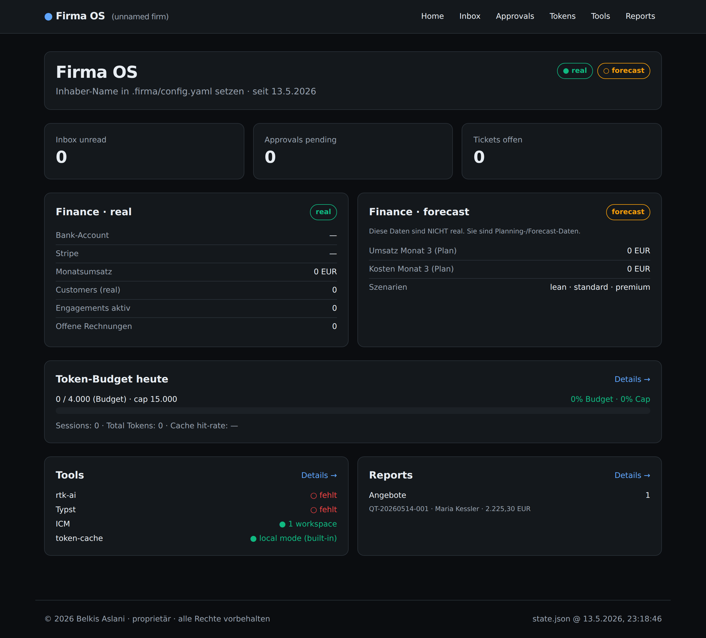
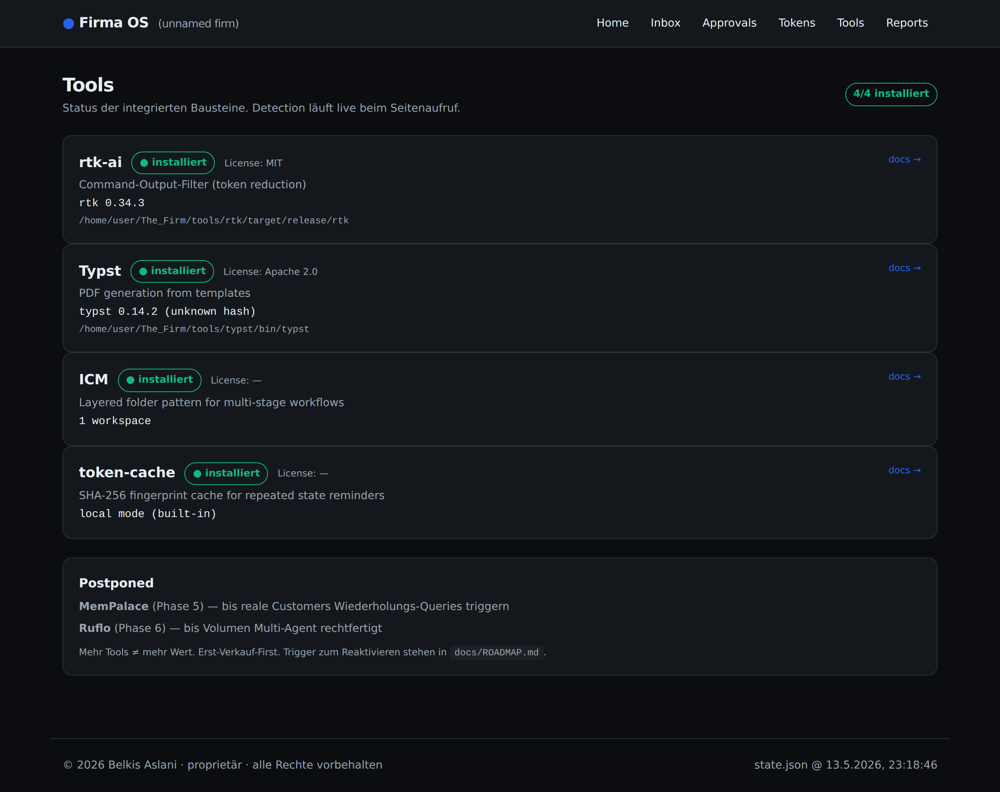
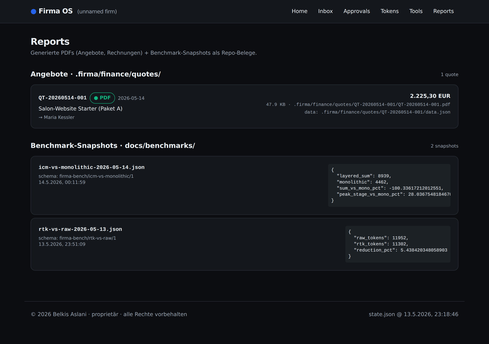
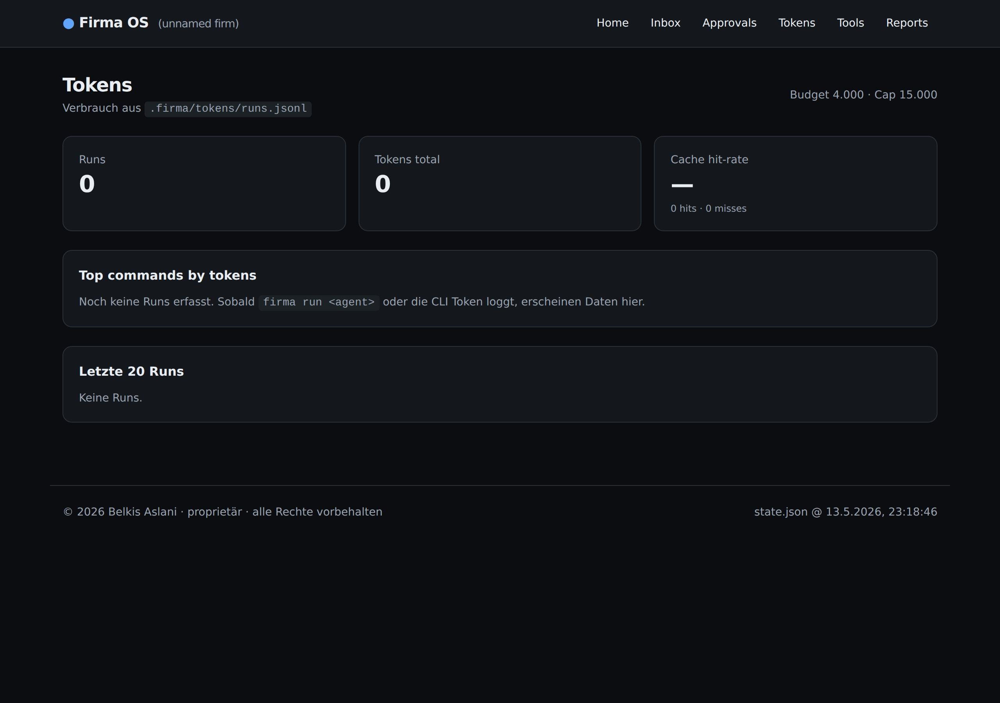
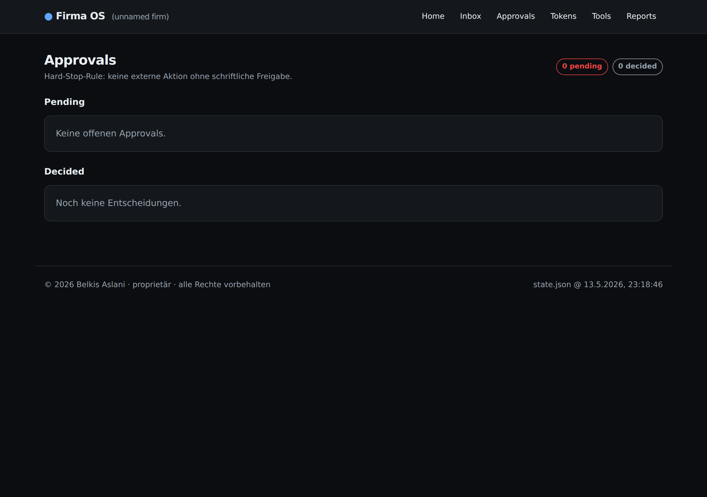
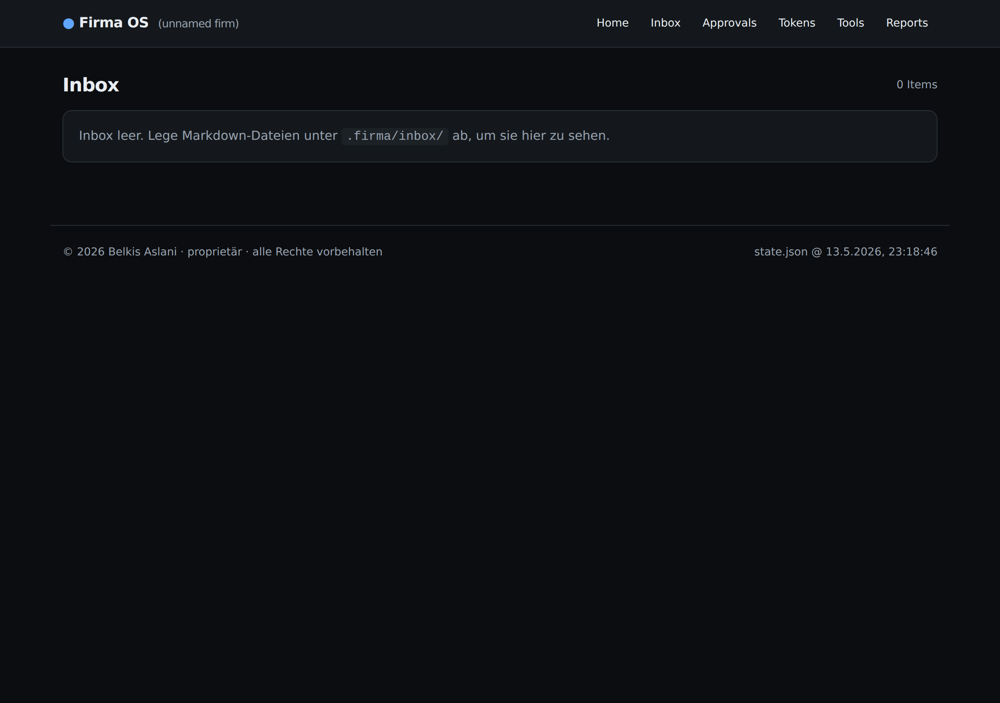

# Firma OS

> Lean operating system for a 1-person AI-native software firm.

Ein schlankes Betriebssystem für eine Einzelperson, die mit KI-Unterstützung echte Software-Dienstleistungen verkauft. Kein Theater, kein Sim-Loop. Klar getrennt: was real ist, was Plan ist.



---

## Status (Stand 2026-05-14)

| Phase | Was | Status | Beleg |
|------:|-----|:------:|-------|
| 0 | Initial Architecture + Specs | ✅ | `docs/ARCHITECTURE.md`, `docs/RATIONALE.md` |
| 1 | CLI + State-Model | ✅ | `scripts/firma/firma.mjs`, `.firma/state.json` |
| 2a | rtk-ai Integration + Benchmark | ✅ | [-5.4 % auf Workload](docs/benchmarks/rtk-vs-raw-2026-05-13.json) |
| 2b | Dashboard MVP (4 + 2 Seiten) | ✅ | `website/` (Next.js 16 + Tailwind 4) |
| 3 | ICM Folder-Pattern | ✅ | [-28 % Peak / +100 % Sum](docs/benchmarks/icm-vs-monolithic-2026-05-14.json) |
| 4 | Typst PDF-Rendering | ✅ | [QT-20260514-001.pdf](docs/quotes/QT-20260514-001.pdf) (PDF/A-2b, 51 KB, ~300 ms) |
| A.1 | Lighthouse CI auf Dashboard | ✅ | [100/100/100/100 mean, 3 routes × 3 runs](docs/benchmarks/lighthouse-dashboard-2026-05-14.json) |
| A.2 | axe-core WCAG 2.1 AA (6 routes) | ✅ | [0 violations nach Fix](docs/benchmarks/axe-dashboard-2026-05-14.json) |
| A.3 | Security-Audit (npm audit + Trivy) | ✅ | [0 CVEs / 0 Secrets nach Fix](docs/benchmarks/security-audit-2026-05-14.json) |
| A.4 | PDF/A-2 Validierung (veraPDF) | ✅ | [PDF/A-2b PASS 6989/0 nach Fix](docs/benchmarks/pdfa-validation-2026-05-14.json) |
| B | Dashboard als Herzstück (Mission Control) | 📋 geplant | [DASHBOARD_VISION.md](docs/DASHBOARD_VISION.md) — Vision + Wireframes + B.1–B.5-Plan |
| 5 | MemPalace (persistentes Memory) | ⏸ Postponed | bis reale Customers Wiederholungs-Queries triggern |
| 6 | Ruflo (Multi-Agent) | ⏸ Postponed | Single-Agent reicht bis Volumen es rechtfertigt |
| 7 | Monetarisierung tief | laufend | — |

**Postponed-Begründung:** Phase 5+6 sind in der Roadmap, werden aber bewusst zurückgehalten, bis ihr Mehrwert konkret messbar wird. Mehr Tools ≠ mehr Wert. Erst-Verkauf-First.

---

## Schnellstart (für die echte Nutzung)

```bash
# 1. Repo klonen
git clone <repo-url>
cd <repo>

# 2. Dependencies
npm install                                  # tiktoken
bash scripts/firma/setup/install-rtk.sh      # ~3 Min, Rust + Cargo nötig
bash scripts/firma/setup/install-typst.sh    # ~5 Min, Rust + Cargo nötig

# 3. Init
node scripts/firma/firma.mjs init

# 4. Dashboard starten (die Oberfläche)
cd website && npm install && npm run dev     # http://localhost:3000
```

Optionale globale CLI:

```bash
sudo ln -sf $(pwd)/scripts/firma/firma.mjs /usr/local/bin/firma
```

---

## Architektur · eine Oberfläche steuert alles

```
┌────────────────────────────────────────────┐
│  DASHBOARD (localhost:3000)                │  ← einzige UI für den Inhaber
│  ─────────────────────────                 │
│  /         Status + Token-Gauge            │
│  /inbox    eingegangene Mails              │
│  /approvals  Hard-Stop pending             │
│  /tokens   Verbrauch + Cache               │
│  /tools    rtk · typst · icm Status        │
│  /reports  PDFs + Benchmark-Snapshots      │
└────────────────────┬───────────────────────┘
                     │ Server Components
                     ▼
┌────────────────────────────────────────────┐
│  .firma/  (Single Source of Truth)         │
│  ─────                                     │
│  state.json · config.yaml                  │
│  inbox/  tickets/  customers/              │
│  finance/quotes/<id>/  approvals/          │
│  icm/triage/  agents/  tokens/             │
└────────────────────┬───────────────────────┘
                     │
                     ▼
┌────────────────────────────────────────────┐
│  CLI · firma <cmd>  (Power-User Backup)    │
│  tools/  (rtk, typst — gitignored)         │
│  scripts/firma/lib  (token-cache, icm,     │
│                      pdf, rtk-exec)        │
└────────────────────────────────────────────┘
```

**Prinzip:** Dashboard ist die Wahrheit. CLI für Automation. Chat (Claude Code) nur für echte Entscheidungen.

### Dashboard-Routen im Detail

| Route | Screenshot |
|-------|-----------|
| `/tools` — Live-Status aller Integrationen |  |
| `/reports` — PDFs + Benchmark-Snapshots |  |
| `/tokens` — Verbrauch, Cache-Hit-Rate, Top-Commands |  |
| `/approvals` — Hard-Stop-Workflow für externe Aktionen |  |
| `/inbox` — eingegangene Mails (`.firma/inbox/`) |  |

Screenshots werden via Playwright reproduziert: `cd website && npm start` + `node scripts/screenshots.mjs`.

---

## Was Firma OS ist

| | |
|---|---|
| **Zielgruppe** | Eine Einzelperson, die Software/KI-Dienste verkauft + ausliefert |
| **Größe** | Repo ~1 MB ohne `tools/` / `node_modules/`. CLAUDE.md ≤ 400 Zeilen. |
| **Lizenz** | proprietär · alle Rechte vorbehalten · siehe [LICENSE](LICENSE) |
| **Token-Budget** | Default 4 000 pro Run · Hard-Cap 15 000 |
| **Sicherheit** | Externe Aktionen brauchen schriftliche Approval (Hard-Stop §6) |
| **Benchmark-Pflicht** | Jedes Tool muss mit anerkannter Methodik gemessen werden ([docs/BENCHMARKS.md](docs/BENCHMARKS.md)) |

---

## Repo-Struktur

```
.
├── CLAUDE.md                        Top-level overview (≤ 400 Zeilen)
├── README.md                        diese Datei
├── LICENSE                          proprietär
├── package.json                     tiktoken + Scripts (test:smoke, bench:*)
├── docs/                            15 .md + benchmarks/ + quotes/
├── website/                         Next.js 16 Dashboard (App Router)
├── scripts/firma/
│   ├── firma.mjs                    Single-file CLI
│   ├── lib/                         token-cache, token-log, rtk-exec, icm, pdf, audit
│   ├── benchmarks/                  rtk, icm, lighthouse, axe, security, pdfa
│   ├── templates/                   quote.typ (Typst)
│   ├── setup/                       install-rtk.sh, install-typst.sh
│   └── test/                        5 Smoke-Tests (npm run test:smoke)
├── .firma/                          State (init via `firma init`)
│   ├── state.json + config.yaml
│   ├── agents/                      8 Agent-Specs
│   ├── icm/triage/                  ICM Workspace (3 stages)
│   ├── finance/quotes/<id>/         Angebot-Daten + PDF
│   ├── inbox/  tickets/  customers/  approvals/  tokens/  cache/  reports/
│   └── templates/
└── tools/                           git-ignored: rtk + typst (lokal gebaut)
```

---

## Tests + Benchmarks (jeder Schritt verifiziert)

```bash
npm run test:smoke         # 5 Smoke-Tests: token-cache, rtk-exec, icm, pdf, audit
npm run bench:rtk          # A/B: raw vs rtk-Output (10 Commands)
npm run bench:icm          # A/B: layered vs monolithic Loading
npm run bench:lighthouse   # Lighthouse 12 auf /, /tools, /reports (3 runs/url)
npm run bench:axe          # axe-core WCAG 2.1 AA auf allen 6 Dashboard-Routen
npm run bench:security     # npm audit + Trivy CVE-Scan (OWASP A06)
npm run bench:pdfa         # veraPDF PDF/A-2b Validierung der gerenderten PDFs
```

Methodik: weltweit anerkannte Standards, jeder Snapshot reproduzierbar.

| Benchmark | Standard | Quelle | Snapshot |
|---|---|---|---|
| Token-Last (rtk, icm) | **tiktoken cl100k_base** (GPT-4) | OpenAI · MIT | `docs/benchmarks/rtk-vs-raw-*.json`, `…/icm-vs-monolithic-*.json` |
| Web Performance + A11y + SEO + BP | **Lighthouse 12** + Core Web Vitals + axe-core Subset | Google · Apache 2.0 / Deque · MPL 2.0 | `docs/benchmarks/lighthouse-dashboard-*.json` |
| Accessibility (WCAG 2.1 A + AA, vollständig) | **axe-core 4** Standalone via Playwright | Deque · MPL 2.0 / W3C | `docs/benchmarks/axe-dashboard-*.json` |
| Security / CVEs | **npm audit** + **Trivy** (OWASP Top 10 A06:2021) | GitHub Advisory DB / Aqua · Apache 2.0 | `docs/benchmarks/security-audit-*.json` |
| PDF-Archivierung | **veraPDF** (ISO 19005-2:2011 · PDF/A-2b) | veraPDF Consortium · MPL 2.0 | `docs/benchmarks/pdfa-validation-*.json` |

---

## Grundprinzipien

1. **Ehrlichkeit über Theater** — real vs. forecast immer getrennt
2. **Dashboard ist die Wahrheit** — klicken statt schreiben
3. **Externe Aktionen brauchen Approval** — Hard-Stop-Rule
4. **Token-Budget pro Run** — Sparsamkeit by default
5. **Single-Agent-Default** — Multi-Agent nur on demand
6. **Reversibilität + Rollback**
7. **Reale Wirtschaftlichkeit** — Pakete kalibriert auf echtes Verdienen
8. **Repo-Hygiene** — keine Datei ohne Zweck

Details: [docs/RATIONALE.md](docs/RATIONALE.md).

---

## Externe Bausteine (Stand der Integration)

| Tool | Rolle | Phase | Status | Lizenz |
|------|-------|:-----:|:------:|--------|
| [rtk-ai/rtk](https://github.com/rtk-ai/rtk) | Command-Output-Filter | 2 | ✅ integriert | MIT |
| [Interpreted-Context-Methodology](https://github.com/RinDig/Interpreted-Context-Methdology) | Folder-Pattern für Reasoning | 3 | ✅ als Pattern adaptiert (kein Code) | — |
| [Typst](https://typst.app/) | PDF-Generation aus Template | 4 | ✅ integriert (statt PDFCraft) | Apache 2.0 |
| ~~PDFCraft~~ | ~~PDF~~ | ~~4~~ | ❌ verworfen | AGPL-3.0 (Trap) |
| [MemPalace](https://github.com/MemPalace/mempalace) | persistentes Memory | 5 | ⏸ postponed | — |
| [Ruflo](https://github.com/ruvnet/ruflo) | Multi-Agent | 6 | ⏸ postponed | — |

Architektur-Vision: [docs/INTEGRATION_BLUEPRINT.md](docs/INTEGRATION_BLUEPRINT.md). Tool-Bewertung: [docs/TOOL_RECOMMENDATIONS.md](docs/TOOL_RECOMMENDATIONS.md).

---

## Lizenz

**Proprietär · Alle Rechte vorbehalten · © 2026 Belkis Aslani.**

Firma OS ist kein Open-Source-Projekt. Keine Erlaubnis zur Nutzung, Modifikation, Verbreitung oder kommerziellen Verwendung ohne ausdrückliche schriftliche Genehmigung des Eigentümers.

Für Lizenz-Anfragen + kommerzielle Nutzung: belkis.aslani@gmail.com.

Siehe [LICENSE](LICENSE) für vollen Text.
